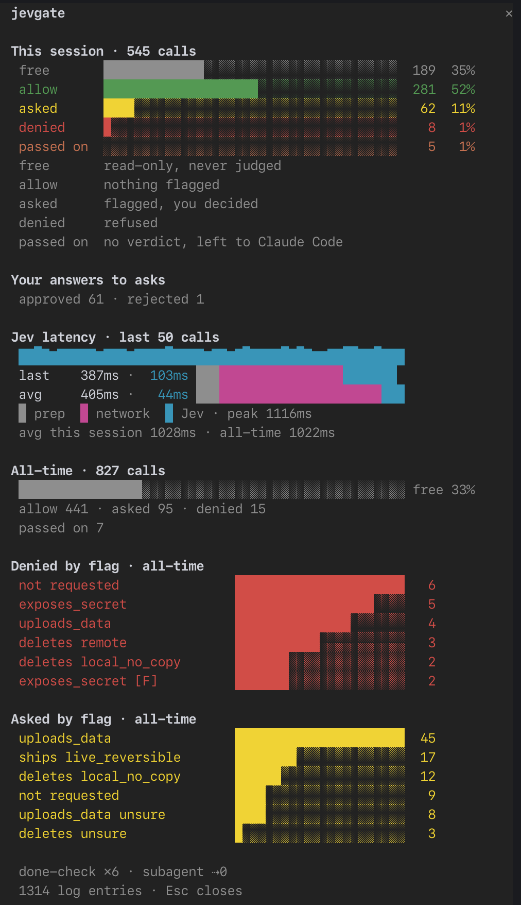

# jevgate

A Claude Code plugin. Before Claude runs a shell command or writes a file, a
small model called Jev (from TypeSafe AI) reports what it would do: delete
something, ship something, change the system, upload data, print a secret.
jevgate turns those facts into an outcome: runs, asks you, or refused. Harmless
commands run, and in auto mode the slow built-in classifier is skipped.
Read-only commands never wait for anything.

Made for `bypassPermissions` mode, where Claude Code itself checks nothing. Works
in every mode.

## Install

```sh
git clone https://github.com/craxrev/jevgate ~/jevgate
claude plugin marketplace add ~/jevgate
claude plugin install jevgate
```

Add your TypeSafe API key to `~/.claude/settings.json`:

```json
{ "env": { "TYPESAFE_API_KEY": "<key>", "CLAUDE_CODE_ENABLE_FUNCTION_HOOKS": "1" } }
```

Needs Claude Code 2.1.281+ with function hooks on (`CLAUDE_CODE_ENABLE_FUNCTION_HOOKS=1`, above): jevgate runs inside Claude Code as a function-hook module. Without them nothing is guarded; jevgate says so when the session starts, and in bypass mode it refuses every guarded call. No build step, no runtime dependencies.

Update: `git -C ~/jevgate pull && claude plugin marketplace update jevgate && claude plugin update jevgate`.

## What you see

Under each judged command, a dim line:

```
⏺ Bash(npm test 2>&1 | tail -20)
  ▸ jevgate allow · nothing flagged · 412ms

⏺ Bash(git reset --hard HEAD~1)
  ? jevgate asked · deletes local_no_copy · 380ms

⏺ Bash(npm publish)
  ✗ jevgate denied · ships public_permanent
```

In the footer, a tally: `jev ✓5 ?2 ⊘1 ✗1 ⇢1 ⇊2` (judged and run, asked, denied,
done-check blocks, subagents refused, compactions).

`/jevgate` opens a panel. It refreshes while open.



## What it does

**Bash guard.** Read-only commands (`git status`, `ls`, `grep`, `cat`, …) run at
once; Jev never sees them. Everything else gets one Jev call that reports seven
facts, and fixed rules pick the outcome:

| Jev finds | You asked for it | You did not |
| --- | --- | --- |
| deletes local data with no copy (uncommitted work, `.env`, outside the repo) | ask | refused |
| deletes remote data (database, cloud, server) | refused | refused |
| a live change: prod deploy, merge, push to main | ask | refused |
| public and permanent: `npm publish`, messages, public releases | refused | refused |
| sudo, or a change beyond your user | ask | refused |
| rewrites remote git history (force push) | ask | refused |
| uploads data to a host you did not declare | ask | refused |
| prints a secret into the conversation | refused | refused |
| Jev unsure about any of these | ask | ask |
| nothing | runs | ask |

"Ask" is a real prompt, in bypass mode too. "You did not" means Jev is fairly
sure (probability ≤ 0.25): at 0.5 it would call one in seven ordinary commands
unasked, at 0.25 about one in thirty. In between it counts as asked.

**File guard.** Edits and writes inside the repo are free. A write outside it
gets one Jev call with the same facts and rules (does it replace data, change
the system, was it asked for), so a change cannot dodge the Bash guard by using
Write instead of `echo >>`. Reading a credential file (`.env`, `~/.ssh`,
`*.pem`) is refused without asking anyone.

**Done-check.** When Claude says it is done, Jev rates how much of your request
the diff covers: none, a small part, most, all. Below "all" jevgate sends a
follow-up prompt naming the missing rung, and Claude goes on in a new turn. At
most twice per request. A turn that changed no files (it only ran or read
things) is not checked.

**Subagent gate.** A subagent is refused when the answer is already in the last
few messages.

**Verbatim compaction.** Instead of a summary, every message is kept as written
and old tool outputs are cut to their first 300 characters. One Jev call picks
the few outputs still worth keeping in full. Nothing is rewritten, nothing is
dropped. Saves less than a summary on text-heavy sessions, around 30–50%.
At 60% context, after a turn, jevgate asks: trim, the built-in summary, or not
yet (asked again at the next 10%). `/compact` asks the same, with Cancel;
`/compact <instructions>` runs the built-in summary with them, without asking. At
Claude Code's own limit its built-in compaction runs, without asking.

If Jev is unreachable (no answer within `timeoutMs`, a rate limit or server
error): in bypass mode commands outside the read-only set are refused, since
nothing else would check them. In other modes jevgate steps aside and Claude
Code behaves as before. A few commands (writing `/etc/hosts`, some SQL) are
blocked by the gateway in front of Jev every time; those are handled the same
way, except in bypass mode, where they are asked. The panel counts both as
passed on.

## Options

Set in `/plugin configure jevgate`. Every feature has its own switch.

| Option | Default | Meaning |
| --- | --- | --- |
| `log` | off | full decisions log (commands, paths, Jev's facts), see below |
| `bashEnabled` | on | Bash guard |
| `bashRecentTurns` | 8 | conversation turns Jev sees (more did not help on real sessions) |
| `fileEnabled` | on | file guard |
| `knownHosts` | empty | comma-separated hosts you own (`box, arch, deploy.example.com`); uploads to them are not flagged |
| `rulesFile` | none | JSON file that overrides outcomes, see below |
| `unsureOutcome` | ask | what an unsure fact does |
| `hitMin` | 0.5 | probability at which a fact counts |
| `noneMin` | 0.6 | probability of "nothing happened" needed to clear a fact |
| `requestedMin` | 0.6 | probability at which a command counts as asked for |
| `unrequestedMax` | 0.25 | probability at or below which it counts as not asked for |
| `doneEnabled` | off | done-check |
| `doneCoverMin` | 2.5 | coverage rung to pass, 0 none … 3 all |
| `doneMaxBlocks` | 2 | follow-ups per request |
| `agentEnabled` | on | subagent gate |
| `agentThreshold` | 0.95 | refuse when the answer is this likely already in context |
| `compactEnabled` | on | verbatim compaction |
| `compactAtPercent` | 60 | context usage at which jevgate asks to compact |
| `compactPreserveRecent` | 6 | newest messages never touched |
| `compactTruncateHeadChars` | 300 | characters kept of a truncated output |
| `compactRestoreTopK` | 5 | outputs Jev may restore in full |
| `compactMinReductionRatio` | 0.25 | below this saving, the conversation is kept as is |
| `apiKey`, `model` | env, `jev-latest` | TypeSafe key and model |

A rules file changes the outcome of any fact value, and can differ per
permission mode:

```json
{ "deletes": { "local_no_copy": "deny" }, "modes": { "auto": { "changes_system": { "true": "allow" } } } }
```

The facts and their values: `deletes` none / local_no_copy / remote, `ships`
none / live_reversible / public_permanent, and yes/no for `changes_system`,
`rewrites_history`, `uploads_data`, `exposes_secret`, and `requested` (its
`false` asks by default; not asked for also turns an ask into a deny).

Logs live in `~/.claude/plugins/data/jevgate*/`, owner-only:

- `stats.jsonl`: one line per decision with what the footer, the row lines and `/jevgate` need (outcome, flags, timings, session), never commands, paths or prompts. Always on.
- `decisions-v2.jsonl`: every decision in full, including the command or path and Jev's facts, scores and gateway responses. Only with the `log` option on.
- `~/.claude/jevgate/run/`: one file per call being judged, gone once Claude Code has the answer (see below).
- `ui.jsonl`: answers and compactions from 0.4.8 to 0.4.10, still read for the counts.

<details>
<summary><b>How it decides</b></summary>

### Bash

1. **Free set.** The command is split (quote-aware, heredocs kept whole) and
   checked against a local copy of Claude Code's own read-only rules: `git
   status`, `ls`, `grep`, `cat`, `sed -n`, `find` without `-delete`/`-exec`, and
   so on; no expansions, subshells, background jobs, or redirects other than
   `2>&1` and `>/dev/null`. Credential paths are excluded so Jev sees them.
   And, as Claude Code does, every path must be under the folder the session
   started in (a shell `cd` does not move it), its own scratchpad, or a
   directory in `permissions.additionalDirectories`: `cat /tmp/x`, `ls ~` and
   `ls ../` are judged, since Claude Code would send them to its classifier.
   About a quarter of real commands are free.
2. **Context.** Gathered without any model: the command as written, `cwd`, the
   repo root, `git remote -v`, `git status --porcelain` when the command touches
   git or files, and the last 8 turns of the conversation with roles. Only your
   turns count as requests; Claude's proposal counts once you agreed to it.
3. **One Jev call** with seven questions. Two are choices with one option per
   outcome (`deletes`, `ships`), five are yes/no (`changes_system`,
   `rewrites_history`, `uploads_data`, `exposes_secret`, `requested`). Options
   that shared an outcome confused Jev, so they were merged.
4. **Facts from probabilities.** A choice option counts when it and the
   stricter options together reach `hitMin` (the top pick alone is not
   trusted). A fact counts as not happening only when "none" reaches
   `noneMin`; in between it is unsure. The rules then take the strictest
   outcome.

| Hook answer | Bypass mode | Auto mode |
| --- | --- | --- |
| deny | refused | refused |
| ask | you are asked | you are asked |
| allow | runs | runs, classifier skipped; your `permissions` rules still apply |

In `dontAsk` mode and headless `claude -p`, an ask is refused.

Measured on 203 labelled cases (hand-written plus real commands): 15 answers
disagreed with the labels, all of them borderline (0.44–0.59), which land on
ask. On 299 commands from real sessions, about 10% were asked or refused. A
judged call takes 0.3–1 s and about 3.3k input tokens.

### Files

| Call | Decided by | Outcome |
| --- | --- | --- |
| write under the folder the session started in, its own scratchpad, or an added directory | local | free |
| write outside | one Jev call | `deletes`, `changes_system`, `requested` with the Bash rules |
| read of a credential path | local | denied |
| any other read | local | silent |

### How a call is judged, and failure

The guards run inside Claude Code, in the module's `tool.call` hook, which comes
before Claude Code's permission step. That keeps one connection to Jev open for
the session: a judged call takes about 300ms (the first about 750ms), against
about 1.6s for the auto-mode classifier. The verdict goes to
`verdicts/<tool_use_id>`, and `hooks/answer.sh`, a tiny PreToolUse hook, answers
Claude Code with it, so an ask is Claude Code's own prompt and an allow skips the
classifier. A function hook cannot answer PreToolUse itself
([#96831](https://github.com/anthropics/claude-code/issues/96831)).

With no verdict (function hooks off, the module failed, or the call changed after
it was judged) `answer.sh` refuses in bypass and dontAsk mode and otherwise
leaves the call to Claude Code, as when Jev is unreachable.

### Compaction

Candidates are tool outputs over 420 characters that are not pinned (first
message, newest `compactPreserveRecent` messages, all Edit/Write results). One
Jev Choice question over the candidate ids, with a `none` option, ranks them
against your last three messages; anything with at least `compactRestoreMinScore`
of the probability, up to `compactRestoreTopK`, is kept in full. If the saving is
under `compactMinReductionRatio`, the conversation is kept as is and a notice
says why.

</details>

## Known limits and to-do

- Uploads to your own server are flagged unless it is in `knownHosts`.
- An unrequested action Jev is unsure about runs: the unrequested local
  `git commit` in the hand cases scores 0.55, above the 0.25 cut-off.
- The file guard asks on every whole-file Write over an existing file outside
  the project. Working on another repo from a different folder means many asks.
- The gateway in front of Jev blocks a few commands by content (`/etc/hosts`,
  some SQL); they are passed on to Claude Code (asked in bypass mode). To do:
  ask TypeSafe about it.
- The done-check skips turns that changed no files, but a turn that did still
  gets judged on the whole working-tree diff, older uncommitted changes
  included. To do: snapshot `git diff` when the turn starts and judge only
  what the turn added.
- The compaction ranking sends a 300-character head per candidate; the heads are
  90% of the request. To do: a shorter ranking head (150 characters) would halve
  the call.
- A judged Bash call costs about 3.3k input tokens, most of them the question
  texts. Cents a day at TypeSafe's price; shorter questions would cut it.
- The dim line appears when a call finishes, not while it runs, and not on rows
  folded into a group.
- Text-heavy sessions compact by 30–50%, not the 80–90% a summary gives.
- The free set copies Claude Code's rules, so a call it lets through should
  never reach the auto-mode classifier. Any that does is logged as `slipped`
  (Claude Code marks such a call `classifierBoundary` in the transcript), kept
  out of the pane; `node scripts/stats.ts` lists them. A directory added with
  `--add-dir` or `/add-dir` is not known to jevgate, so paths there are judged.
- Function hooks are early access and change between releases; the types in
  `types/` are regenerated per release with `/plugin-types types`.
- The done-check's follow-up shows as a prompt from jevgate in the transcript;
  its text is the generic reason with scores. To do: a shorter, specific one.

## Development

```sh
npm test                                    # unit tests, fake Jev, sanitized command corpus
npm run typecheck
TYPESAFE_API_KEY=... npm run probe [done|agent]              # live Jev on hand-written cases
TYPESAFE_API_KEY=... node scripts/probe-facts.ts --out r.jsonl # guard facts: labelled cases + corpus
node scripts/probe-facts.ts --replay r.jsonl --none 0.5        # re-score saved answers, no calls
TYPESAFE_API_KEY=... node scripts/probe-files.ts --real         # file guard: labelled writes + your outside writes
claude --plugin-dir ~/jevgate --debug hooks # run from the checkout without installing
```

`scripts/session-analysis/` dumps your own transcripts' Bash calls for tuning
(`dump_buckets.py`; keep its output out of any repo). `/plugin-types types`
regenerates `types/claude-code.d.ts` after a Claude Code upgrade.

MIT.
